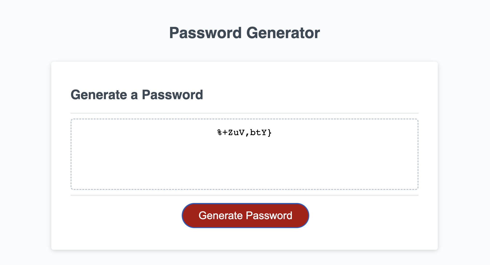

# password-generator

## Description 

Alongside HTML and CSS starter code provided, I have written JavaScript code to create a Password Generator which runs in the browser. 

The password generator generates a password when the 'generate' button is clicked. The user is presented with a prompt to enter the password length, which needs to meet the criteria of at least 10 characters but no more than 64 characters.

The user must then select which characters they'd like to make up their password out of lowercase, uppercase, numeric and special characters. At least one must be selected. 

Once the user answers all the prompts, the password will be generated and displayed on the page.

My motivation behind this was to advance my learning and showcase my skills using JavaScript.

## Screenshot

## Link
https://sophiedodsworth.github.io/password-generator/

## License 
MIT license